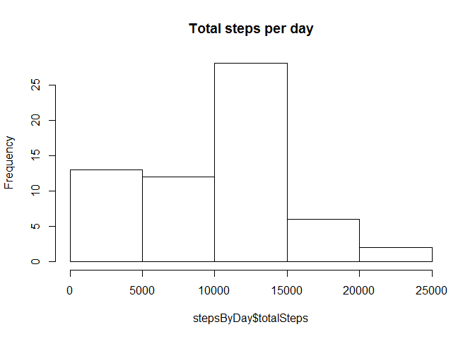

# Reproducible Research: Peer Assessment 1


```
## Loading required package: knitr
```

## Loading and preprocessing the data

```r
unzip("activity.zip")
activity <- read.csv("activity.csv")
activity$date <- as.Date(activity$date)
```

## What is mean total number of steps taken per day?

```r
library(dplyr, warn.conflicts = FALSE)
stepsByDay <- activity %>%
    group_by(date) %>%
    summarise(totalSteps = sum(steps, na.rm = TRUE))

hist(stepsByDay$totalSteps, main = "Total steps per day")
```

 

```r
stepStats <- stepsByDay %>%
    summarise(mean = mean(totalSteps), median = median(totalSteps)) %>%
    as.data.frame()

print(stepStats)
```

```
##      mean median
## 1 9354.23  10395
```

## What is the average daily activity pattern?

```r
stepsByInterval <- activity %>%
    group_by(interval) %>%
    summarise(meanSteps = mean(steps, na.rm = TRUE))

plot(meanSteps ~ interval, data = stepsByInterval,
     type = "l", ylab = "average steps", main = "Steps by interval averaged across all days")
```

 

Which 5-minute interval, on average across all the days in the dataset, contains the maximum number of steps?

```r
stepsByInterval[which.max(stepsByInterval$meanSteps),]$interval
```

```
## [1] 835
```


## Imputing missing values
How many NAs we have?

```r
print(length(which(is.na(activity$steps))))
```

```
## [1] 2304
```

Let's replace NA steps with averages across interval

```r
activityFixed <- activity
for(i in which(is.na(activity$steps))) {
    naInterval <- activity[i,]$interval
    activityFixed[i,]$steps <- filter(stepsByInterval, interval == naInterval)$meanSteps
}
```

Let's compare estimates of fixed dataset with original

```r
stepsByDayFixed <- activityFixed %>%
    group_by(date) %>%
    summarise(totalSteps = sum(steps))

hist(stepsByDayFixed$totalSteps, main = "Total steps per day (imputed)")
```

 

```r
stepStatsFixed <- stepsByDayFixed %>%
    summarise(mean = mean(totalSteps), median = median(totalSteps)) %>%
    as.data.frame()

print(stepStatsFixed)
```

```
##       mean   median
## 1 10766.19 10766.19
```

Recall estimates of original dataset

```r
print(stepStats)
```

```
##      mean median
## 1 9354.23  10395
```

As we can see, imputing of missing data increases daily number of steps.

## Are there differences in activity patterns between weekdays and weekends?

Create a new factor variable in the dataset with two levels – “weekday” and “weekend” indicating whether a given date is a weekday or weekend day.


```r
library(chron)
activityFixed$dayType <- "weekday"
activityFixed[is.weekend(activityFixed$date),]$dayType <- "weekend"
activityFixed$dayType <- as.factor(activityFixed$dayType)
```

Plot of the difference between daily activity on weekdays and weekends

```r
stepsByDayTypeAndInterval <- activityFixed %>%
    group_by(dayType, interval) %>%
    summarise(steps = mean(steps))

library(ggplot2)
qplot(interval, steps, data = stepsByDayTypeAndInterval, geom = "line") + facet_grid(dayType ~ .)
```

 
